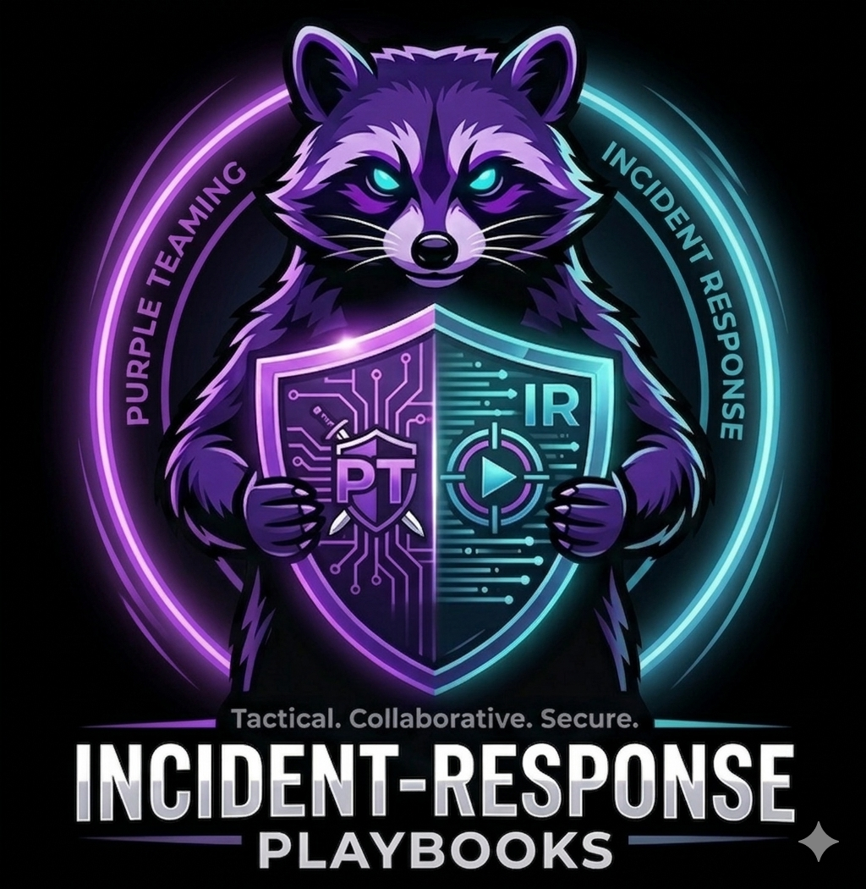

<p align="center">
  
</p>

<p align="center"><em>// Purple Team Incident Response Playbook Planner</em></p>

A browser-based modelling tool for designing, analysing, and executing **operations-informed incident response playbooks** with full **MITRE ATT&CK** and **D3FEND** mapping support. Built on the RaccoonIR metamodel (based on FRIPP, Shaked et al. 2023), combining PROVE artifact-centric process modelling with dependency models and CiO-based operational metrics.

**Zero dependencies. Runs entirely in the browser. GitHub Pages compatible.**

---

## Features

### Core Modelling
- **Dependency Models** — hierarchical AND/OR/UNCONTROLLABLE paragon trees with probability propagation
- **Playbook Editor** — hierarchical incident response process modelling with drill-down navigation
- **Artifact Flow** — track evidence and data products through the playbook lifecycle
- **Roles & Actuators** — assign human and machine resources to activities

### Analysis & Simulation
- **Impact View** — side-by-side playbook + DM with ActivityImpact arrows and step-through simulation
- **Metrics Engine** — CiO (Change in Operations) computation with scope filtering
- **Critical Thresholds** — stakeholder notification system with breach detection
- **Snapshots** — capture and replay model state at any milestone

### MITRE Integration
- **MITRE ATT&CK Mapping** — link playbook activities to ATT&CK techniques (T-codes) with direct links
- **MITRE D3FEND Mapping** — map defensive countermeasures to containment/eradication activities
- **MITRE View** — dedicated tab showing all TTPs grouped by tactic with navigation to linked activities
- **Paragon-level TTP display** — see which ATT&CK/D3FEND techniques relate to each dependency model node

### Additional
- **Cross-DM References** — link paragons across multiple dependency models
- **SYMBIOSIS Module** — GQM-based security measurement framework
- **Example Library** — 5 real-world IR playbooks mapped to ATT&CK + D3FEND

---

## Quick Start

```bash
# Serve locally (any static file server works)
python -m http.server 8080
# Open http://localhost:8080
```

Or deploy directly to **GitHub Pages** — no build step required.

### First Steps

1. Click **Library** in the toolbar to load an example playbook
2. Switch between tabs: **Dependency Models**, **Playbooks**, **Impact View**, **MITRE View**
3. Select any paragon or activity to see its properties, metrics, and MITRE mappings

---

## Example Playbooks

| File | Scenario | ATT&CK | D3FEND |
|------|----------|--------|--------|
| `phishing-t1566.json` | Phishing Attack Response | T1566, T1204, T1078 | D3-ER, D3-HD, D3-DNSDL, D3-UBA |
| `ransomware-t1486.json` | Ransomware Incident Response | T1486, T1490, T1021, T1059, T1562 | D3-NI, D3-BAN, D3-FE, D3-SYSM |
| `password-spraying-t1110.json` | Password Spraying Attack | T1110.003, T1078, T1087, T1021 | D3-AL, D3-MFA, D3-AAORT, D3-CRED |
| `process-injection-t1055.json` | Process Injection Response | T1055, T1059, T1003 | D3-PSA, D3-MA, D3-EAL, D3-DLIC |
| `drive-by-compromise-t1189.json` | Drive-by Compromise Response | T1189, T1203, T1071, T1105 | D3-WF, D3-DNSDL, D3-BI, D3-UA |
| `supply-chain-t1195.json` | Supply Chain Compromise Response | T1195, T1059, T1105 | D3-SV, D3-HV, D3-NTA |
| `insider-threat-t1078.json` | Insider Threat Response | T1078, T1074, T1530 | D3-UBA, D3-AM, D3-SDA |
| `data-exfiltration-t1041.json` | Data Exfiltration Response | T1041, T1560, T1048 | D3-NTA, D3-DLP, D3-OTF |

---

## File Format

Projects save as `.raccoon-ir.json` — a single JSON file containing both the information model and representation data (node positions, zoom levels).

Additionally supports importing:
- `.raccoon` — SecMoF XML playbook format
- `.dependencymodel` — SecMoF XML dependency model format

---

## Architecture

```
index.html              App shell
css/raccoon-ir.css      Purple/dark theme
js/
  app.js                Main controller (RaccoonIRApp)
  models.js             Data model factories & registry
  dm-editor.js          SVG dependency model editor
  pb-editor.js          SVG playbook process editor
  impact-view.js        Impact simulation view
  metrics.js            Probability & CiO computation
  metamodel-data.js     RACCOON_METAMODEL constant
  storage.js            Serialization & import/export
  help.js               Tutorial & about content
examples/
  manifest.json         Example library index
  *.json                Pre-built playbooks
```

---

## Metamodel

RaccoonIR implements a metamodel combining four packages:

| Package | Source | Purpose |
|---------|--------|---------|
| **DependencyModel** | Cherdantseva et al. 2022 | Hierarchical paragon trees with probability propagation |
| **PROVE** | Shaked et al. 2022 (ICED21) | Artifact-centric process modelling |
| **RaccoonIR** | Based on FRIPP (Shaked et al. 2023) | PlaybookProcess, ActivityImpact, CiO, MITRE mappings |
| **SYMBIOSIS** | symbiosisDM.ecore | GQM security measurement framework |

---

## Academic References

- Shaked et al. (2023). *Operations-informed incident response playbooks.* Computers & Security.
- Shaked et al. (2022). *FRIPP — A metamodel for formalised response to incidents process playbooks.* ARES 2022.
- Shaked et al. (2022). *PROVE Tool.* ICED21.
- Cherdantseva et al. (2022). *SCADA Dependency Model.*

---

## License

MIT
